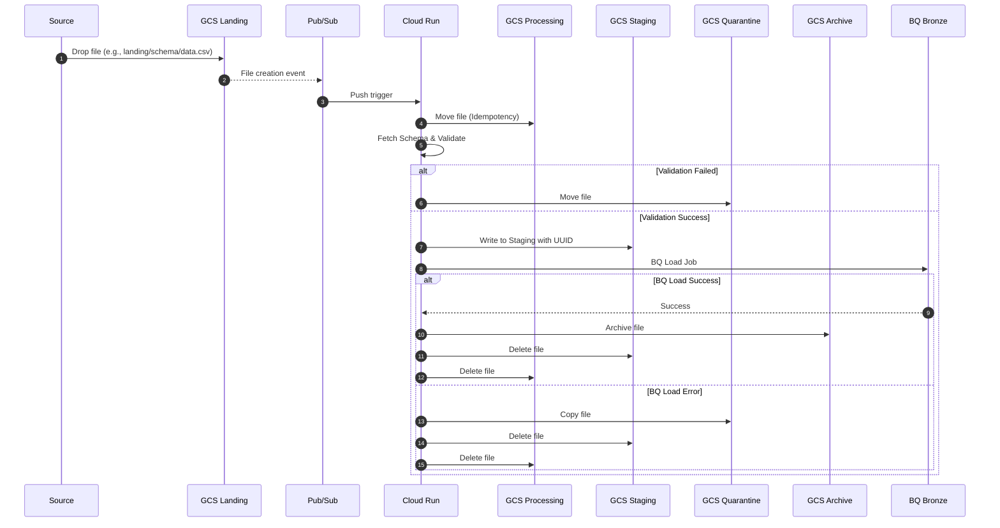
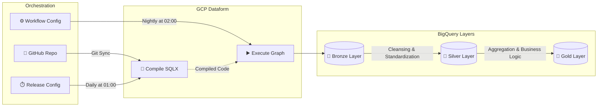

# PYL Data Platform


A robust, scalable, and Event-Driven Enterprise Data Platform, deployed 100% natively on Google Cloud Platform.

This platform implements the Medallion architecture (Bronze, Silver, Gold) and ensures rigorous data quality control at the edge (Edge Ingestion) using a strict validation approach (All-or-Nothing).

---

## 🏗️ Global Architecture

The architecture is fundamentally split into two distinct and asynchronous paradigms:

### 1. Event-Driven Ingestion (Real-time / Micro-batch)
The ingestion phase is fully decoupled and reactive:



1. **GCS Landing**: A file (CSV or JSONL) lands in the `landing` bucket. Files should include the target schema in their path (e.g., `landing/<schema_name>/data.csv`). If dropped at the root, the service extracts the schema name from the filename (e.g., `data.csv` -> `data`).
2. **Pub/Sub Notification**: Cloud Storage natively generates an event to a Pub/Sub topic.
3. **Cloud Run**: The Python service (deployed on Cloud Run) is triggered by a Pub/Sub push. It dynamically fetches the corresponding YAML schema definition from the `SCHEMA_BUCKET` via the GCS API before parsing the data. (Schemas are synced from the `schemas/` repository folder to this bucket via CI/CD).
4. **Validation (All-or-Nothing)**: The file is streamed and validated against its schema (`Pydantic` + stdlib `csv`/`json`). The service enforces idempotency by attempting to move the file from `landing` to a dedicated `processing` bucket before validation. The Pub/Sub subscription must be configured with a 600s `ack_deadline`.
   - **Failure Recovery & Lifecycles**: If the Cloud Run instance times out or crashes, the file remains orphaned in `processing`. GCS lifecycle rules automatically clean up `processing` (1 day) and `staging` (1 day). Quarantined files are moved to `Nearline` after 30 days and deleted after 90 days.
   - 🟢 **Success**: If 100% of the file is valid, it is written to a `staging` bucket with a unique UUID to avoid concurrent overwrites, and then atomically loaded into BigQuery (**Bronze** layer) using a BQ Load Job.
       - On **BQ Load Failure**: The file is copied to `quarantine` and strictly deleted from `staging` and `processing` buckets.
       - On **BQ Load Success**: The file is archived to the `archive` bucket and strictly deleted from both `staging` and `processing` buckets.

### 2. Batch Transformation (Git-Synced)
Business transformations are not tied to the ingestion of a specific file but run globally:



1. **Git Sync**: GCP Dataform natively pulls the SQLX code from the GitHub repository (via a Secret Manager token).
2. **Release Config**: A `daily-release` compiles the latest `main` branch code every day at 01:00 UTC.
3. **Workflow Config**: A `nightly-workflow` executes the compiled release every day at 02:00 UTC.
4. **BigQuery (Silver / Gold)**: Dataform executes the SQLX dependency graph:
   - Cleansing and standardization (**Silver**).
   - Aggregation and final business models (**Gold**).

> **Architecture Note (ADR-002)**: Cloud Scheduler is no longer used for Dataform orchestration. Dataform's native `release_config` + `workflow_config` handle compilation and execution scheduling natively — reducing moving parts and eliminating the need for OAuth token management.

---

## 📊 Observability & Monitoring

The platform features an Enterprise-grade centralized observability framework:
- **Log Router**: All logs (Cloud Run, Dataform) are intercepted by a sink and centralized into a BigQuery dataset (`observability_logs`).
- **Cloud Monitoring**: Specific Dashboards monitor Ingestion Success Rate, Quarantined Files, DLQ depth, and Dataform Execution Time.
- **Alerting & SLOs**: Service Level Objectives (SLOs) are defined for ingestion success (99.9%) and latency. Alerts (DLQ overflow, 5xx errors, quarantine spikes) trigger email notifications. See `docs/SLOs.md` and `docs/runbooks/` for operational procedures.

---

## 🛠️ Tech Stack

| Component | Technology | Role |
| :--- | :--- | :--- |
| **Infrastructure** | Terraform | Pure IaC provisioning, multi-environment |
| **Cold Storage** | Google Cloud Storage | Landing, Staging, and Quarantine Buckets |
| **Data Warehouse** | BigQuery | Bronze, Silver, Gold + Logs Datasets |
| **Ingestion Compute**| Cloud Run + Python 3.11 | Pydantic/stdlib validation and BQ Loading |
| **Messaging** | Cloud Pub/Sub | Ingestion decoupling via GCS Notifications |
| **Transformation** | GCP Dataform | SQLX Modeling (Silver / Gold), Custom Assertions |
| **Orchestration** | Dataform native cron | Release Config (compile) + Workflow Config (execute) |
| **CI/CD & Testing** | GitHub Actions + Pytest | Automated deployment, `tfsec`, `pytest` w/ coverage |

---

## 📂 Repository Structure

The project is organized following Domain-Driven Design (DDD) principles applied to IaC:

```text
pyl-data-platform/
├── docs/                        # Strategic documentation and ADRs
│   ├── ADRs/                    # Decision history (e.g., Superseding Workflows)
│   ├── runbooks/                # Operational runbooks (DLQ, Quarantine, Dataform failures)
│   └── SLOs.md                  # Service Level Objectives definitions
├── schemas/                     # Agnostic data contracts (yaml files with versioning & descriptions)
├── env/                         # Environment-specific configuration
├── src/
│   └── ingestion/               # Source code for the Cloud Run container (Python)
│       ├── main.py              # API Entrypoint (Pub/Sub Push) & `/health` route
│       ├── validator.py         # Strict "All-or-Nothing" validation logic
│       ├── tests/               # Pytest unit tests and mocks
│       ├── pyproject.toml       # Python config (ruff, pytest, mypy)
│       └── Dockerfile           # Multi-stage, non-root container definition
├── dataform/                    # Dataform repository
│   ├── definitions/
│   │   ├── assertions/          # Custom data quality tests
│   │   ├── bronze/              # External source definitions
│   │   ├── silver/              # Cleansing models (Incremental)
│   │   └── gold/                # BI / Aggregation models
│   └── dataform.json
└── terraform/                   # Infrastructure as Code
    ├── main.tf                  # Terraform entrypoint
    ├── variables.tf             # Global variables (environments)
    └── modules/                 # Reusable modules (Modularity-first)
        ├── bigquery/            # BigQuery Datasets (for_each) & IAM
        ├── dataform/            # Dataform Repository, Release & Workflow configs
        ├── ingestion/           # Cloud Run, SA, PubSub Push config, DLQ
        ├── monitoring/          # Log router, BQ Logs dataset, Dashboards, Alerts
        └── storage/             # GCS Buckets (Landing, Staging, Quarantine, Processing), Notifications
```

---

## 🚀 Deployment Guide (Terraform)

Provisioning is handled on an environment basis via Terraform. The `tfstate` must be configured to point to the appropriate backend bucket.

### 1. Prerequisites
- [Google Cloud SDK](https://cloud.google.com/sdk/docs/install) (`gcloud`)
- [Terraform](https://developer.hashicorp.com/terraform/install) (>= 1.5.0)
- Administrator rights on the target GCP project (Owner or equivalent granular roles).

### 2. Authentication
```bash
gcloud auth application-default login
```

### 3. Local Deployment (Example for 'dev')
Ensure that your configuration is defined in `env/config.dev.yaml`.

```bash
cd terraform

# Initialize backend and download providers
terraform init -backend-config="bucket=my-project-dev-tfstate"

# Syntax validation
terraform validate

# Plan
terraform plan -var="environment=dev"

# Apply
terraform apply -var="environment=dev"
```

---

## 💻 Local Development (Python)

To modify and test the ingestion code (Cloud Run):

```bash
cd src/ingestion

# Create virtual environment
python -m venv .venv
source .venv/bin/activate

# Install dependencies (including dev)
pip install -r requirements.txt
pip install pytest pytest-cov ruff mypy

# Run test suite
pytest tests/ -v --cov=.

# Format code
ruff check . --fix

# Run locally
uvicorn main:app --reload --port 8080
```

---

## 🔐 Security & Governance

- **Principle of Least Privilege**: IAM roles are scoped at the resource level (Bucket and Dataset level). Project-wide roles like `dataEditor` are strictly avoided. Each component (Cloud Run, Dataform) runs with a dedicated Service Account.
- **Encryption**: All data is encrypted at rest using Google-managed encryption keys.
- **Auditability**: 100% of execution logs are traced and auditable via the `observability_logs` in BigQuery.
- **Production Safety Guards**: Terraform resources (Buckets) use conditional `force_destroy` and versioning is enabled on critical entrypoints (Landing).

---

> _Documentation generated and maintained according to Stream Coding (SC) principles._
