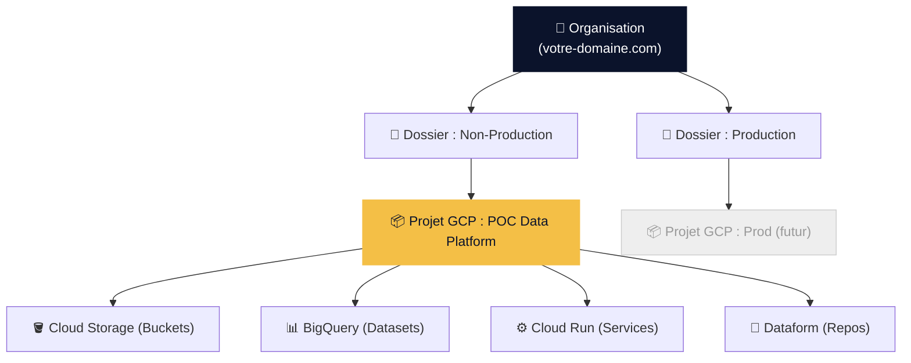
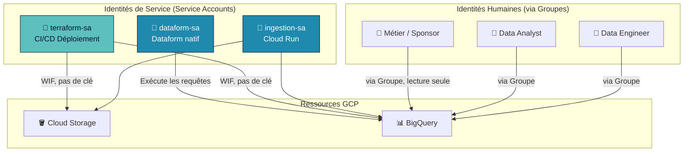
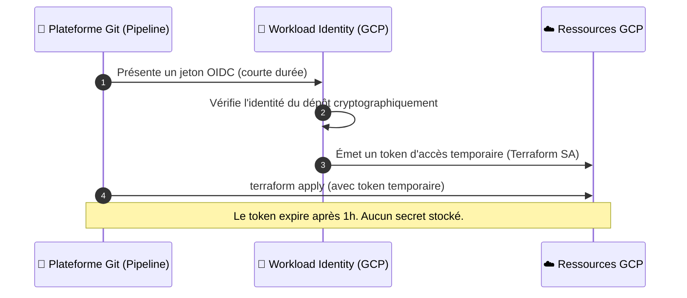
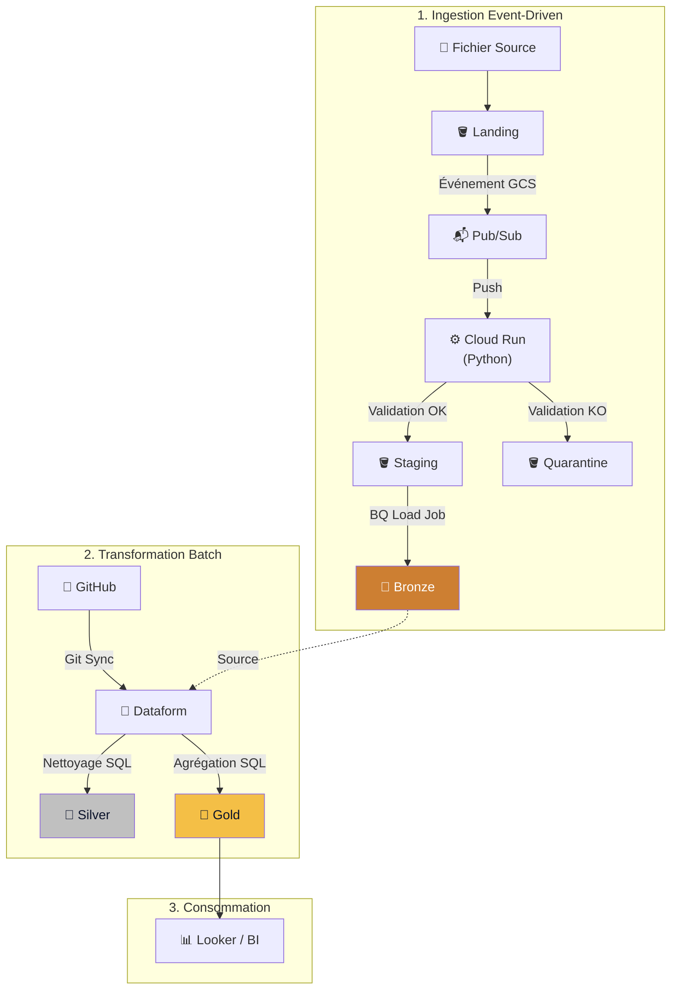
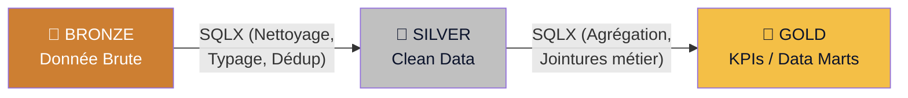
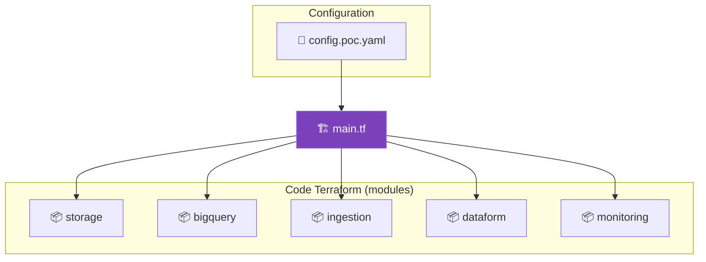
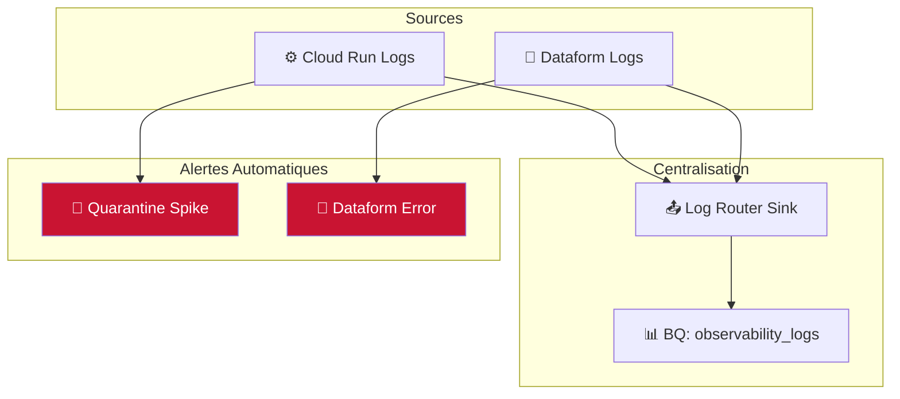

# Pyl.Tech : Atelier de Lancement - Data Platform (Phase POC)

> **Date** : Mai 2026 | **Auteurs** : Équipe Pyl.Tech
> *Support de cadrage technique pour l'atelier 1 (Architecture & Socle).*

*Ce document est conçu pour être déroulé pas à pas. Il vous guidera dans la compréhension de l'architecture cible et l'exécution des prérequis techniques.*

---

## 1. Gouvernance & Fondations GCP

L'objectif du POC est de valider la valeur technique sur un périmètre restreint, tout en respectant dès le premier jour les standards de sécurité (isolation, IAM, CI/CD).

### 1.1. L'Organisation et les Projets (Landing Zone)

GCP structure les ressources de manière hiérarchique. Le POC s'exécutera dans un conteneur (Projet) totalement isolé de votre production actuelle ou future.

L'avantage majeur de votre environnement est que votre **Organisation GCP est déjà créée et liée à votre annuaire Google Workspace**. 

**Todo :**
1. **Vérifier l'Organisation** : Connectez-vous sur `console.cloud.google.com` (en tant qu'admin). Votre domaine doit apparaître en haut à gauche.
2. **Créer le Projet POC** : Créez un projet nommé par exemple `idex-poc-data` dans un dossier "Non-Production".
3. **Activer les APIs** sur ce projet : `bigquery.googleapis.com`, `run.googleapis.com`, `pubsub.googleapis.com`, `storage.googleapis.com`, `dataform.googleapis.com`, `secretmanager.googleapis.com`.

---

## 2. Gestion des Identités et Accès (IAM)

Nous appliquons une séparation stricte entre les accès humains (Groupes) et les accès machines (Comptes de Service), basée sur le principe du moindre privilège.

### 2.1. Cartographie des Accès (RBAC)

### 2.2. Les Groupes Humains (Action Requise)

Les groupes créés dans votre console d'administration Workspace sont nativement reconnus par GCP. **Aucun droit nominatif ne sera distribué**.

**Todo :**
1. Allez sur `admin.google.com` > Annuaire > Groupes.
2. Créez les 3 groupes ci-dessous.
3. Ajoutez l'équipe Pyl.Tech au groupe Engineers.

| Groupe Workspace | Périmètre d'Accès GCP |
|:-----------------|:----------------------|
| `gcp-data-engineers@votre-domaine.com` | **Admin/Écriture** : Maintenance infra, ingestion, datasets Bronze/Silver/Gold. |
| `gcp-data-analysts@votre-domaine.com` | **Lecture/Analyse** : Requêtage Dataform, accès complet Gold, lecture Bronze/Silver. |
| `gcp-business-users@votre-domaine.com` | **Lecture Seule** : Consultation restreinte au dataset Gold (Data Marts/BI). |

### 2.3. Les Comptes de Service (Gérés par le code)

Ces comptes machines sont créés automatiquement par notre code Terraform. Ils ne partagent jamais leurs droits :
- `ingestion-sa` : Écrit dans Cloud Storage (Processing/Quarantine) et BigQuery (Bronze).
- `terraform-sa` : Déploie l'infrastructure (CI/CD).
- `dataform-sa` : Exécute les transformations SQLX dans BigQuery.

---

## 3. Sécurité CI/CD : Approche Zero Trust (WIF)

**Règle d'or : Aucune clé JSON statique de compte de service ne sera exportée ni stockée.**

Pour éviter toute fuite de credentials (par ex. un développeur qui "commit" une clé sur Git), nous utilisons **Workload Identity Federation (WIF)** :

**Todo :**
1. Identifier votre outil Git (GitHub, GitLab...).
2. Pyl.Tech paramétrera avec vous le Workload Identity Pool sur GCP pour approuver spécifiquement ce dépôt.

---

## 4. Architecture Globale de la Plateforme

L'architecture est découpée en deux flux asynchrones et découplés : l'ingestion (Event-Driven) et la transformation (Batch Medallion).

### 4.1. Flux d'Ingestion : La règle du "All-or-Nothing"

Dès qu'un fichier source (CSV/JSONL) est déposé sur Cloud Storage :
1. **Événement Pub/Sub** : Déclenche immédiatement le service d'ingestion (Cloud Run).
2. **Validation stricte (YAML)** : Vérification du typage et des règles métier.
3. **Poison Pill Handling** : Si une seule ligne est invalide, le fichier entier est rejeté en **Quarantaine**. S'il est 100% valide, il est chargé de manière atomique dans la table **Bronze** (BigQuery). L'entrepôt n'est jamais pollué par des données partielles.

### 4.2. Flux de Transformation (Dataform)

Dataform orchestre nativement la transformation de la donnée brute en indicateurs métier, via du code SQLX synchronisé avec votre dépôt Git.

---

## 5. Pratiques d'Ingénierie (GitOps & Terraform)

L'intégralité du socle (Réseau, Stockage, IAM, Compute) est définie en code Terraform.

- **Reproductibilité** : L'environnement peut être recréé à l'identique en quelques minutes.
- **Mises en production** : Les déploiements (Infra, Code Python, SQL Dataform) sont 100% automatisés via votre outil CI/CD (validation via `terraform plan` systématique).

---

## 6. Observabilité et Alerting

Même en phase POC, une supervision proactive est configurée pour remonter les anomalies :

| Type d'Alerte | Cause Principale | Action requise |
|:--------------|:-----------------|:---------------|
| **Quarantine Spike** | Un fichier source a échoué à la validation YAML. | Vérifier le format du fichier déposé. |
| **Dataform Error** | Échec d'un test qualité (doublon, valeur nulle inattendue). | Analyser la requête SQL en erreur. |

---

## 7. Synthèse et Discussion d'Atelier

### 7.1. Checklist des Actions Client

Ces actions sont les prérequis bloquants pour démarrer l'implémentation technique du POC.

| Priorité | Action | Responsable |
|:--------:|:-------|:------------|
| 🔴 | Créer le **projet GCP POC** (dossier Non-Prod). | Admin GCP Client |
| 🔴 | Créer les **3 groupes IAM Workspace** (Engineers, Analysts, Business). | Admin Workspace |
| 🔴 | Valider le **dépôt Git** et l'outil CI/CD (GitHub, GitLab...). | Chef de Projet |
| 🟡 | Configurer le **Workload Identity (WIF)**. | Admin GCP + Pyl.Tech |
| 🟡 | Donner lesaccès Git/Workspace à l'équipe Pyl.Tech. | Chef de Projet |

### 7.2. Questions Ouvertes

**Données & Use Cases** :
- Quels sont les cas d'usage métiers prioritaires à démontrer dans le POC ?
- Quels sont les formats (CSV, JSONL, Excel ?), volumes et fréquences des fichiers sources ?
- Les fichiers sources seront-ils déposés manuellement ou via un système automatisé (SFTP, API) ?

© Copyright 2026 Pyl.Tech

