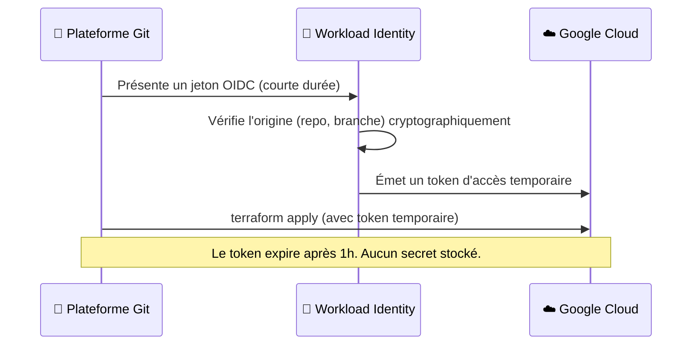
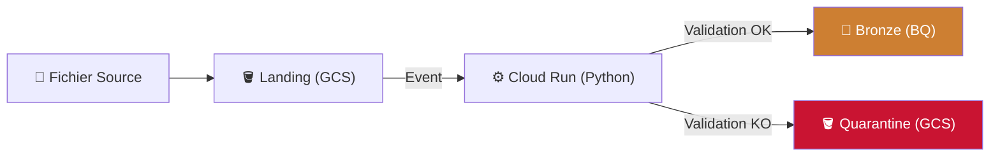
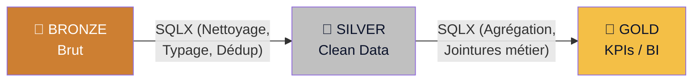

# Pyl.Tech : Atelier de Lancement - Data Platform (Phase POC)

> **Date** : Mai 2026 | **Auteurs** : Équipe Pyl.Tech
> *Support de cadrage technique pour l'atelier 1 (Architecture & Socle).*

---

## 1. Gouvernance & Fondations GCP

L'objectif du POC est de valider la valeur technique sur un périmètre restreint, tout en respectant les standards de sécurité (isolation, IAM, CI/CD).

### 1.1. Isolation du Projet (Landing Zone)

Le POC s'exécute dans un environnement Cloud totalement étanche par rapport à votre production.

- **Organisation GCP** : Déjà existante et liée à votre annuaire Google Workspace.
- **Dossier (Folder)** : Création d'un dossier "Non-Production".
- **Projet POC** : Un projet dédié (ex: `idex-poc-data`) hébergeant l'intégralité des ressources du pilote (facturation et droits isolés).

**APIs à activer :** `bigquery.googleapis.com`, `run.googleapis.com`, `pubsub.googleapis.com`, `storage.googleapis.com`, `dataform.googleapis.com`, `secretmanager.googleapis.com`.

---

## 2. Gestion des Identités et Accès (IAM)

Nous appliquons une séparation stricte entre les accès humains (Groupes) et les accès machines (Comptes de Service), basée sur le principe du moindre privilège.

### 2.1. Les Groupes Humains (Google Workspace)

L'avantage de votre environnement est que les groupes créés dans la console d'administration Workspace sont nativement reconnus par GCP IAM.

*Action requise : Créer ces 3 groupes dans votre console admin Workspace.*

| Groupe Workspace | Périmètre d'Accès GCP |
|:-----------------|:----------------------|
| `gcp-data-engineers@votre-domaine.com` | **Admin/Écriture** : Maintenance infra, ingestion, datasets Bronze/Silver/Gold. |
| `gcp-data-analysts@votre-domaine.com` | **Lecture/Analyse** : Requêtage Dataform, accès complet Gold, lecture Bronze/Silver. |
| `gcp-business-users@votre-domaine.com` | **Lecture Seule** : Consultation restreinte au dataset Gold (Data Marts/BI). |

### 2.2. Les Comptes de Service (Machines)

Créés automatiquement par notre code Terraform, ces comptes ne partagent jamais leurs droits :
- `ingestion-sa` : Écrit dans Cloud Storage (Processing/Quarantine) et BigQuery (Bronze).
- `terraform-sa` : Déploie l'infrastructure (CI/CD).
- `dataform-sa` : Exécute les transformations SQLX dans BigQuery.

---

## 3. Sécurité CI/CD : Approche Zero Trust (WIF)

**Règle d'or : Aucune clé JSON statique ne sera exportée ni stockée.**

Pour éviter toute fuite de credentials, nous utilisons **Workload Identity Federation (WIF)** :

1. Le pipeline CI/CD (ex: GitHub Actions) s'authentifie via OIDC.
2. GCP vérifie l'identité du dépôt Git cryptographiquement.
3. GCP émet un jeton éphémère (durée < 1h) pour le déploiement Terraform.

---

## 4. Architecture de la Plateforme

L'architecture est découpée en deux flux asynchrones et découplés : l'ingestion (Event-Driven) et la transformation (Batch Medallion).

### 4.1. Flux d'Ingestion (Event-Driven)

Dès qu'un fichier source (CSV/JSONL) est déposé sur Cloud Storage :
1. **Événement Pub/Sub** : Déclenche immédiatement le service d'ingestion (Cloud Run).
2. **Validation stricte (YAML)** : Vérification du typage et des règles métier.
3. **All-or-Nothing** : 
   - *Valide (100%)* ➔ Chargement atomique dans la table **Bronze** (BigQuery).
   - *Invalide (≥ 1 ligne en erreur)* ➔ Rejet du fichier complet en **Quarantaine** (GCS). L'entrepôt n'est jamais pollué par des données partielles.

### 4.2. Flux de Transformation (Dataform)

Orchestration native GCP pour transformer la donnée brute en indicateurs métier, via du code SQLX synchronisé avec votre dépôt Git.

---

## 5. Pratiques d'Ingénierie (GitOps & Terraform)

L'intégralité du socle est définie en code Terraform et répartie en modules réutilisables (`storage`, `bigquery`, `ingestion`, `dataform`, `monitoring`).

- **Reproductibilité** : L'environnement peut être recréé à l'identique en quelques minutes.
- **Contrôle Qualité** : Tout changement passe par un scan de sécurité (`tfsec`) et une validation (`terraform plan`) avant application.
- **Mises en production** : Les déploiements (Infra, Code Python, SQL Dataform) sont 100% automatisés via votre outil CI/CD.

---

## 6. Observabilité et Alerting

Même en phase POC, une supervision proactive est configurée pour remonter les anomalies aux équipes via Cloud Logging et Cloud Monitoring :

| Type d'Alerte | Cause Principale | Action requise |
|:--------------|:-----------------|:---------------|
| **Quarantine Spike** | Un fichier source a échoué à la validation YAML. | Vérifier le format du fichier déposé. |
| **Dataform Error** | Échec d'un test qualité (doublon, valeur nulle inattendue). | Analyser la requête SQL en erreur. |
| **Pipeline CI/CD 5xx** | WIF expiré ou droits IAM insuffisants. | Vérifier la configuration OIDC. |

---

## 7. Synthèse et Checklist d'Actions Client

Ces actions sont les prérequis bloquants pour démarrer l'implémentation technique du POC.

| Priorité | Action | Responsable |
|:--------:|:-------|:------------|
| 🔴 | Créer le **projet GCP POC** (dossier Non-Prod). | Admin GCP Client |
| 🔴 | Créer les **3 groupes IAM Workspace** (Engineers, Analysts, Business). | Admin Workspace |
| 🔴 | Valider le **dépôt Git** et l'outil CI/CD (GitHub, GitLab...). | Chef de Projet |
| 🟡 | Configurer le **Workload Identity (WIF)**. | Admin GCP + Pyl.Tech |
| 🟡 | Donner lesaccès Git/Workspace à l'équipe Pyl.Tech. | Chef de Projet |

© Copyright 2026 Pyl.Tech

