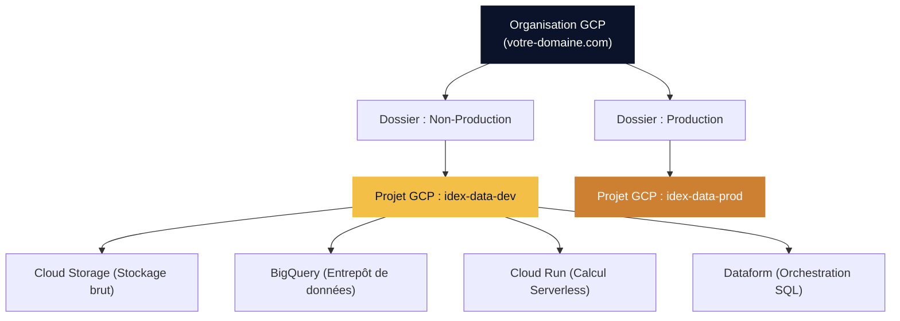
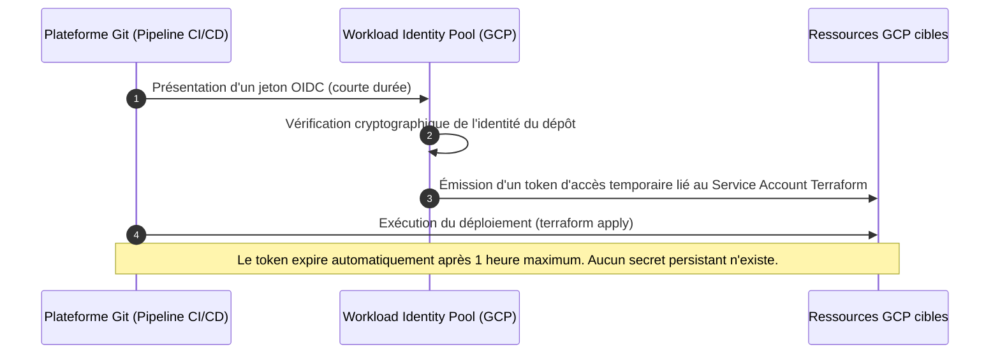
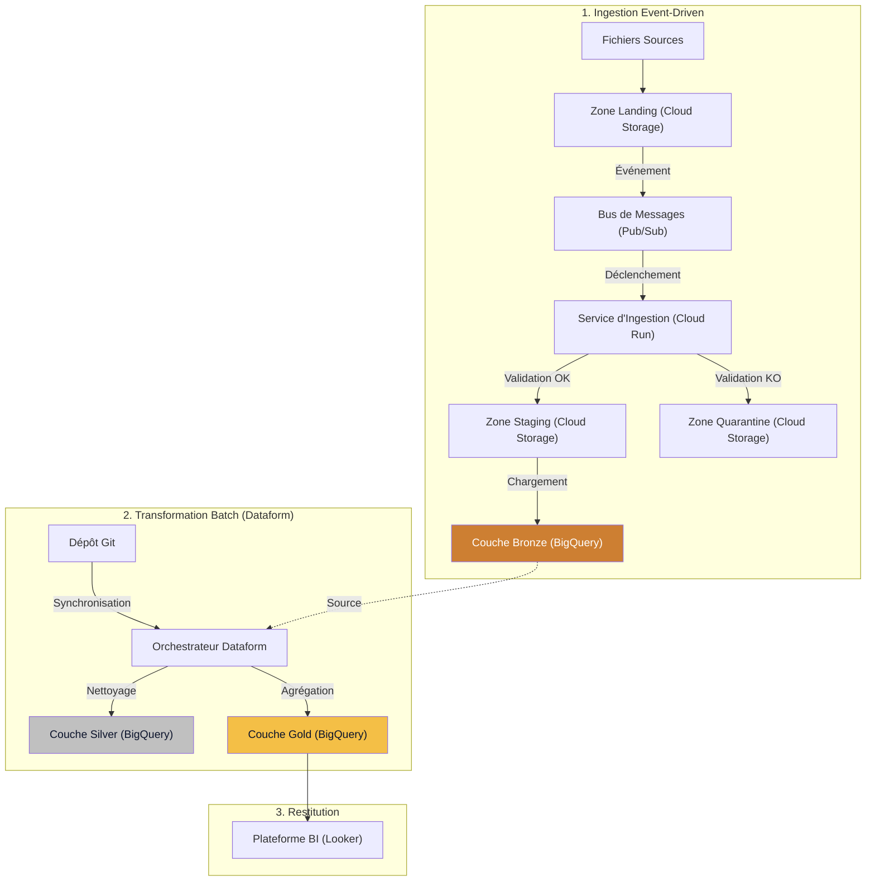
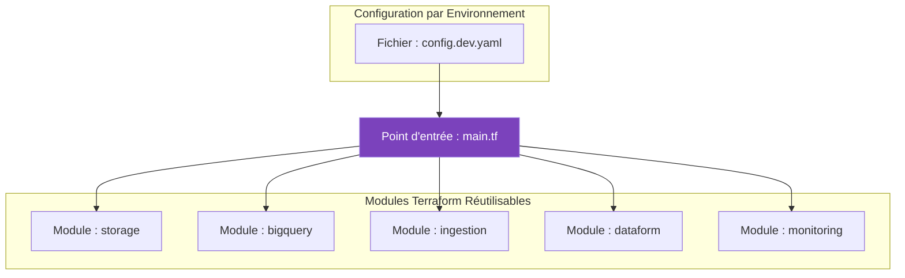
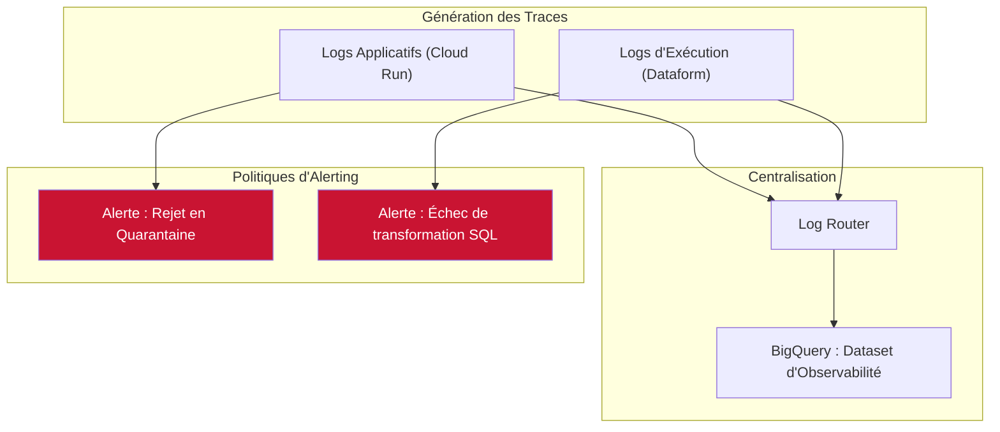

# Support de Cadrage : Architecture GCP, Landing Zone & Identités

> **Date** : Mai 2026 | **Auteurs** : Équipe d'Architecture Pyl.Tech
> *Support technique pour l'Atelier 1 (Architecture & Socle).*

*Ce document de référence synthétise les choix architecturaux et les prérequis techniques liés au déploiement de la Data Platform. Il est conçu pour être autoporteur et consultable a posteriori par l'ensemble des parties prenantes (architectes, administrateurs réseau, chefs de projet).*

---

## 1. Gouvernance et Fondations Cloud

L'objectif est de déployer le socle "Secure by Design" et de préparer la gestion des identités. Cela posera des bases saines, notamment pour la sécurité du futur Agent IA.

### 1.1. Modèle d'Organisation et de Projets (Environnement POC)

GCP structure les ressources de manière hiérarchique. L'objectif de cette phase est de **prouver la valeur métier** sur un périmètre restreint (POC). 

La plateforme s'exécutera dans des Projets GCP temporaires, isolés de votre production actuelle. Si le projet se pérennise, une véritable "Landing Zone" d'entreprise sera définie avec vos équipes sécurité, et nous pourrons tout y redéployer proprement. 

Cependant, pour démontrer dès aujourd'hui les avantages d'une plateforme industrielle, nous utilisons d'emblée l'automatisation (Terraform) avec deux environnements de travail : **Dev** et **Prod**.

Bonne nouvelle : votre **Organisation GCP** existe déjà et est nativement liée à votre annuaire Google Workspace. Cela va grandement faciliter la gestion des accès.

**Actions Requises :**
1. **Vérifier l'Organisation** : Connectez-vous sur `console.cloud.google.com`. Votre domaine doit apparaître en haut à gauche.
2. **Créer les 2 Projets GCP** : `idex-data-dev` et `idex-data-prod`.
3. **Activer les APIs GCP** : `bigquery.googleapis.com`, `run.googleapis.com`, `pubsub.googleapis.com`, `storage.googleapis.com`, `dataform.googleapis.com`, `secretmanager.googleapis.com`.
4. **Instance Looker** : Validation et création de l'instance de test Looker.

---

## 2. Gestion des Identités et des Accès (IAM)

Nous séparons strictement les accès humains (Groupes) des accès machines (Comptes de Service), toujours sur le principe du moindre privilège.

### 2.1. Matrice des Rôles et Autorisations (RBAC)

Le tableau ci-dessous formalise l'affectation des droits sur les ressources GCP :

| Type d'Identité | Rôle Fonctionnel | Mode d'Authentification | Périmètre d'Accès Autorisé |
|:---|:---|:---|:---|
| **Humain** | Data Engineer | SSO Google Workspace (via Groupe) | **BigQuery** (Lecture/Écriture), **Cloud Storage** |
| **Humain** | Data Analyst | SSO Google Workspace (via Groupe) | **BigQuery** (Lecture et Écriture limitées aux Data Marts) |
| **Humain** | Utilisateur Métier | SSO Google Workspace (via Groupe) | **BigQuery** (Lecture seule sur les indicateurs agrégés) |
| **Service (Machine)** | `ingestion-sa` (Cloud Run) | Compte de Service Natif GCP | **Cloud Storage** (Processing), **BigQuery** (Bronze) |
| **Service (Machine)** | `terraform-sa` (CI/CD) | Workload Identity Federation | **Toutes ressources** (Déploiement Infrastructure as Code) |
| **Service (Machine)** | `dataform-sa` | Compte de Service Natif GCP | **BigQuery** (Exécution des transformations SQLX) |

### 2.2. Administration des Utilisateurs Humains

Il faut définir comment l'équipe PylTech accèdera aux ressources. Puisque nous sommes tous sur Google Workspace, 3 options s'offrent à nous :

1. **Ajout direct de nos emails** (`@pyl.tech`) dans vos groupes Workspace IDEX (Solution recommandée et la plus simple).
2. **Whitelisting du domaine** `@pyl.tech` sur votre tenant GCP (Si l'Option 1 est bloquée par vos règles de sécurité).
3. **Création d'identités externes IDEX** pour les consultants (ex: `consultant.ext@idex.com`). C'est l'approche la plus lourde (gestion de licences).

Durant la phase de développement, les équipes de réalisation nécessitent un niveau d'accès `Owner` (Propriétaire) sur le projet `dev` afin de garantir la vélocité. Le projet `prod` appliquera quant à lui une approche stricte de "Least Privilege".

**Actions Requises :**
1. Création de trois groupes de sécurité dans l'annuaire Google Workspace :
   - `gcp-data-engineers@votre-domaine.com`
   - `gcp-data-analysts@votre-domaine.com`
   - `gcp-business-users@votre-domaine.com`
2. Affectation de l'équipe Pyl.Tech au groupe "Engineers" selon l'option d'intégration retenue.

### 2.3. Sécurité des Comptes de Service

Ces comptes applicatifs sont créés automatiquement par notre code Terraform. Ils ne partagent jamais leurs droits entre eux.

---

## 3. Sécurité des Déploiements : Workload Identity (WIF)

**Règle d'or : Aucune clé JSON statique ne sera exportée ni stockée.**

Les clés statiques sont la principale cause de failles de sécurité dans le Cloud. Pour sécuriser le pipeline CI/CD, nous utilisons **Workload Identity Federation (WIF)**. 

Ce standard permet à votre outil Git de s'authentifier auprès de GCP de manière sécurisée et éphémère, sans utiliser de mot de passe.

**Actions Requises :**
1. Validation de l'outil de versioning (GitLab, GitHub, etc.) qui hébergera le code source.
2. Configuration conjointe du `Workload Identity Pool` sur GCP pour n'approuver que les requêtes provenant spécifiquement de ce dépôt autorisé.

---

## 4. Architecture Logique de la Plateforme

L'architecture est découpée en deux flux asynchrones et découplés : l'Ingestion (Event-Driven) et la Transformation (Batch Medallion).

### 4.1. Flux d'Ingestion ("Circuit Breaker")

Dès qu'un fichier source est déposé, l'ingestion démarre. La règle du "All-or-Nothing" s'applique :

1. La réception d'un fichier déclenche Pub/Sub.
2. Cloud Run valide strictement le fichier vis-à-vis de son contrat (Schéma YAML).
3. **Tout ou rien** : Si le fichier a une seule erreur, tout le fichier part en Quarantaine. S'il est 100% valide, il part en Bronze (BigQuery). L'entrepôt n'est jamais pollué par des données partielles.

### 4.2. Transformation (Medallion)

Dataform orchestre la transformation de la donnée brute en indicateurs métiers :
- **Bronze** : Donnée brute, historisée.
- **Silver** : Donnée nettoyée, typée, dédupliquée.
- **Gold** : Donnée agrégée (KPIs, Data Marts) pour Looker.

---

## 5. Standards d'Ingénierie (Infrastructure as Code)

L'intégralité du socle technique (Réseau, Stockage, IAM, Traitements) est provisionnée via du code Terraform.

Cette approche déclarative assure :
- **L'audits de sécurité continus** : Le code est analysé (via `tfsec`) avant chaque déploiement.
- **La reproductibilité** : L'environnement peut être recréé ou dupliqué (pour de nouveaux environnements) avec une fiabilité totale.

---

## 6. Stratégie d'Observabilité et d'Alerting

L'environnement intègre une supervision proactive via la suite Google Cloud Operations (Logging et Monitoring) afin de détecter et de qualifier les anomalies techniques ou fonctionnelles.

| Catégorie d'Anomalie | Cause Fonctionnelle Typique | Action Opérationnelle Requise |
|:--------------|:-----------------|:---------------|
| **Rejet en Quarantaine** | Le format du fichier reçu diverge du contrat de données défini (ex: changement de séparateur, colonne manquante). | Investigation du fichier déposé et concertation avec le fournisseur de données. |
| **Échec Dataform** | Les règles de qualité métier (Quality Gates) n'ont pas été respectées (ex: violation d'unicité, valeur aberrante). | Analyse de la requête SQL en erreur au sein de l'interface Dataform. |

---

## 7. Synthèse et Checklist de Déploiement

### 7.1. Prérequis Bloquants

Les actions suivantes constituent le chemin critique pour l'initialisation technique du projet.

| Priorité | Action Requise | Responsabilité |
|:--------:|:-------|:------------|
| **[Critique]** | Instanciation des **2 projets GCP** (Dev, Prod). | Administrateur GCP IDEX |
| **[Critique]** | Création des **3 groupes de sécurité Workspace** (Engineers, Analysts, Business). | Administrateur Workspace IDEX |
| **[Critique]** | Validation de l'accès pour l'équipe **Alliance Decideom x PylTech** (Ajout direct des courriels, Whitelist, ou création d'identités externes). | Administrateur IAM IDEX |
| **[Critique]** | Validation du **référentiel Git** cible et de l'outil CI/CD. | Direction de Projet |
| **[Important]** | Paramétrage du **Workload Identity Federation (WIF)**. | Administrateur GCP + Architecte Pyl.Tech |
| **[Important]** | Validation et instanciation de l'environnement de test **Looker**. | Direction de Projet |

### 7.2. Sujets à Documenter (Questions Ouvertes)

**Sécurité Réseau et Conformité** :
- Quelle est la politique de sécurité de base d'IDEX concernant les accès cloud (Restrictions par adresse IP, obligation de transit par VPN, usage de VPC Service Controls) ?
- La fédération d'identités existante est-elle formellement documentée et accessible pour consultation ?

**Données et Cas d'Usage** :
- Quels sont les cas d'usage métiers prioritaires à démontrer afin de valider la valeur du pilote ?
- Quels sont les formats exacts, la volumétrie prévisionnelle et la fréquence de rafraîchissement des fichiers sources ?
- Le dépôt des fichiers sur le Cloud Storage sera-t-il effectué manuellement par les utilisateurs ou via un système de transfert automatisé ?

Document Confidentiel - © Copyright 2026 Pyl.Tech

