# Pyl.Tech : Atelier de Lancement - Data Platform (Phase POC)

> **Date** : Mai 2026 | **Auteurs** : Équipe Pyl.Tech

*Ce document constitue le support de l'atelier de cadrage technique. Il est conçu pour être autoportant : un lecteur technique doit pouvoir comprendre l'architecture, les prérequis et les actions à mener sans autre support oral.*

*À terme, nous irons vers une industrialisation complète (Landing Zone sécurisée, réseau privé, chiffrement CMEK, Dataplex). L'objectif immédiat du POC est de valider la valeur technique et métier rapidement.*

---

## 1. Google Cloud Platform : Les Fondamentaux

### 1.1. L'Organisation et les Projets

GCP structure les ressources de manière hiérarchique. Chaque niveau hérite des politiques de sécurité du niveau parent.

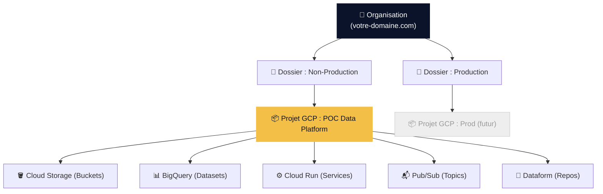

| Concept | Définition | Analogie |
|:--------|:-----------|:---------|
| **Organisation** | Racine de votre entreprise sur GCP. Hérite du domaine Google Workspace ou Cloud Identity. | Le siège social |
| **Dossier (Folder)** | Groupement logique de projets (ex: par environnement, par BU). | Un département |
| **Projet GCP** | Conteneur isolé : les ressources, les droits IAM et la facturation sont cloisonnés par projet. | Un bureau fermé à clé |

**Pour le POC** : Un seul projet GCP suffit (ex: `mon-client-poc-data`). Il sera totalement isolé du reste de votre organisation.

### 1.2. Création de l'Organisation GCP (si inexistante)

Si votre entreprise n'a pas encore d'Organisation GCP, il faut en créer une. L'Organisation est **automatiquement créée** lorsque vous associez un domaine vérifié à GCP via l'un de ces deux services :

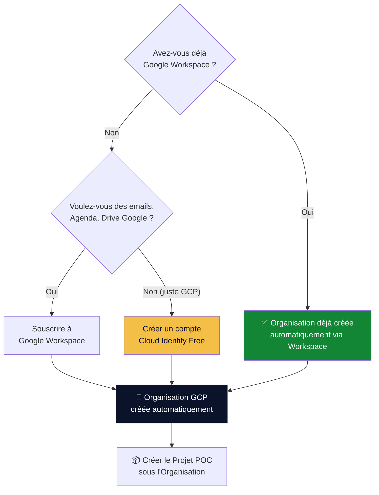

| Option | Quand la choisir | Coût |
|:-------|:-----------------|:-----|
| **Google Workspace** | Vous utilisez déjà (ou souhaitez utiliser) Gmail, Drive, Agenda pour votre entreprise. L'Organisation GCP est créée automatiquement. | À partir de 6€/utilisateur/mois |
| **Cloud Identity Free** | Vous voulez **uniquement** gérer des identités et accéder à GCP, sans suite bureautique. Parfait pour les entreprises qui utilisent déjà Microsoft 365 ou un autre système de messagerie. | Gratuit (jusqu'à 50 utilisateurs) |

#### Étapes pour créer une Organisation via Cloud Identity Free

1. **Vérifier la propriété de votre domaine** :
   - Rendez-vous sur [admin.google.com](https://admin.google.com) et démarrez l'inscription Cloud Identity.
   - Google vous demandera de prouver que vous possédez le domaine `votre-entreprise.com` en ajoutant un enregistrement DNS (TXT ou CNAME) chez votre registrar (OVH, Gandi, Cloudflare, etc.).

2. **Créer le compte Super Admin** :
   - Un premier compte administrateur est créé lors de l'inscription (ex: `admin@votre-entreprise.com`).
   - Ce compte aura les droits d'administration totaux sur Cloud Identity ET sur l'Organisation GCP.

3. **L'Organisation GCP apparaît automatiquement** :
   - Une fois le domaine vérifié, rendez-vous sur [console.cloud.google.com](https://console.cloud.google.com).
   - L'Organisation portant le nom de votre domaine apparaît automatiquement dans le sélecteur de ressources.

4. **Créer les utilisateurs et groupes** :
   - Dans la console d'administration ([admin.google.com](https://admin.google.com)), créez les utilisateurs de votre équipe technique.
   - Créez les groupes IAM nécessaires (cf. §2.2 de ce document).

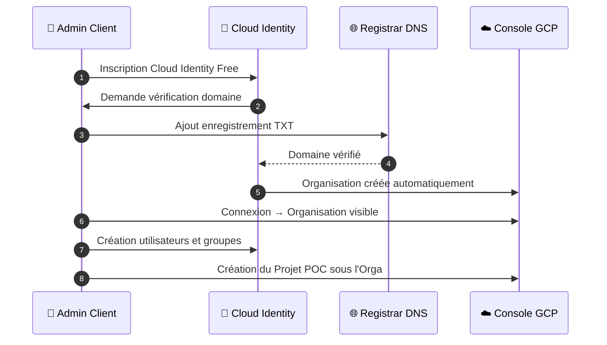

> **Note importante** : Si votre entreprise possède déjà un annuaire Active Directory / Entra ID (Azure AD), il est possible de synchroniser les utilisateurs vers Cloud Identity via **Google Cloud Directory Sync (GCDS)** ou **Entra ID provisioning**. Cela évite de gérer les identités en double. Cette synchronisation pourra être mise en place lors de la phase d'industrialisation.

### 1.3. Les APIs GCP à Activer

Avant toute création de ressource, les APIs des services utilisés doivent être activées sur le projet POC. Cela se fait en un clic dans la console ou via `gcloud` :

```bash
gcloud services enable \
  bigquery.googleapis.com \
  run.googleapis.com \
  pubsub.googleapis.com \
  storage.googleapis.com \
  dataform.googleapis.com \
  secretmanager.googleapis.com \
  cloudresourcemanager.googleapis.com \
  iam.googleapis.com \
  --project=MON-PROJET-POC
```

---

## 2. Gestion des Identités et des Accès (IAM)

### 2.1. Les Deux Types d'Identités

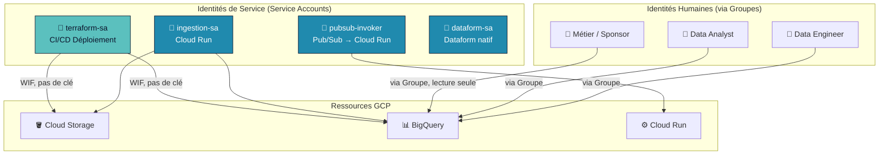

- **Identités Humaines** : Vos collaborateurs. On ne donne **jamais** de droits nominatifs (directement à `jean.dupont@...`). On passe toujours par des **Groupes**.
- **Service Accounts** : Des identités machines. Chaque composant (Cloud Run, Pub/Sub, Terraform) a son propre SA dédié et isolé. Un SA ne partage jamais ses droits avec un autre.

### 2.2. Les Groupes à Créer (Action Client)

Nous demandons la création de 3 groupes dans votre annuaire (Google Workspace, Active Directory / Entra ID, ou Cloud Identity) :

| Groupe | Membres | Rôles GCP assignés | Périmètre |
|:-------|:--------|:-------------------|:----------|
| `gcp-data-engineers@votre-domaine.com` | Pyl.Tech + Équipe technique client | `roles/bigquery.dataEditor` | Datasets Bronze, Silver, Gold |
| | | `roles/bigquery.dataViewer` | Dataset Observability |
| `gcp-data-analysts@votre-domaine.com` | Analystes et Data Scientists | `roles/bigquery.dataViewer` | Datasets Bronze, Silver |
| | | `roles/bigquery.dataEditor` | Dataset Gold (créer des vues) |
| `gcp-business-users@votre-domaine.com` | Sponsors, Métiers, Direction | `roles/bigquery.dataViewer` | Dataset Gold uniquement |

**Principe fondamental** : Les droits sont attribués **au niveau du Dataset**, jamais au niveau du projet. Un Business User ne voit que le Gold, jamais le Bronze brut.

### 2.3. Les Service Accounts Créés Automatiquement (par Terraform)

Ces comptes sont créés et configurés par notre code Terraform. Aucune action client n'est requise.

| Service Account | Rôle | Ce qu'il peut faire | Ce qu'il NE peut PAS faire |
|:----------------|:-----|:---------------------|:---------------------------|
| `ingestion-sa` | Service d'ingestion (Cloud Run) | Lire le Landing, écrire dans Processing/Staging, charger dans Bronze, écrire en Quarantine | Écrire dans Silver ou Gold, supprimer des datasets |
| `pubsub-invoker` | Invocateur Pub/Sub | Invoquer le service Cloud Run | Rien d'autre |
| `terraform-sa` | Déploiement CI/CD | Créer/modifier toute l'infrastructure | Accéder aux données métier |
| SA natif Dataform | Exécution des transformations | Lire Bronze, écrire Silver et Gold | Toucher au stockage GCS |

### 2.4. Le Modèle RBAC Complet (Qui Accède à Quoi)

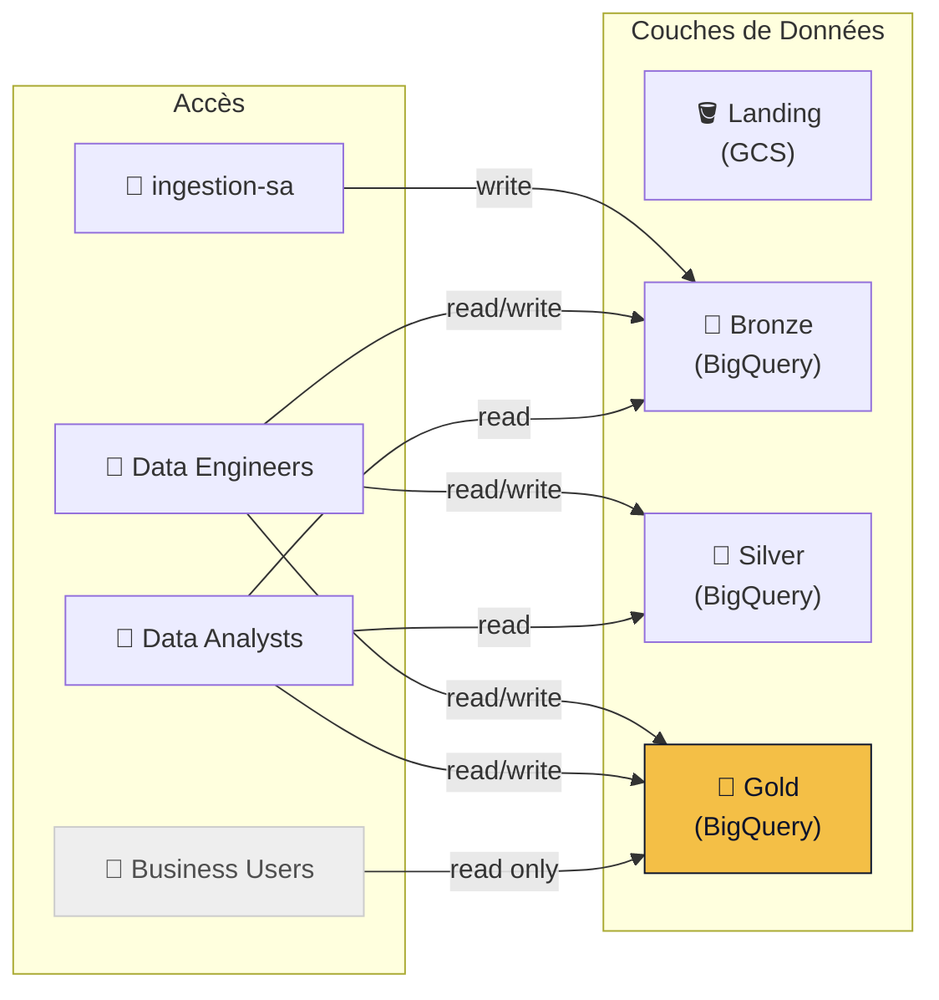

---

## 3. Prérequis Techniques pour le POC

### 3.1. Checklist des Actions Client

| # | Action | Responsable | Détails |
|:-:|:-------|:------------|:--------|
| 1 | Créer un projet GCP dédié au POC | Admin GCP Client | Un projet isolé (ex: `mon-client-poc-data`) dans un dossier Non-Production |
| 2 | Activer les APIs (cf. §1.2) | Admin GCP Client | BigQuery, Cloud Run, Pub/Sub, Storage, Dataform, Secret Manager, IAM |
| 3 | Créer les 3 groupes IAM (cf. §2.2) | Admin Workspace/AD | `gcp-data-engineers`, `gcp-data-analysts`, `gcp-business-users` |
| 4 | Ajouter les membres Pyl.Tech au groupe Engineers | Admin Workspace/AD | Emails Pyl.Tech communiqués séparément |
| 5 | Créer un bucket GCS pour le state Terraform | Admin GCP Client | Ex: `mon-client-poc-tfstate` avec versioning activé |
| 6 | Configurer le Workload Identity Federation (cf. §3.2) | Admin GCP + Pyl.Tech | Connexion sécurisée entre votre outil de versioning et GCP |
| 7 | Identifier et communiquer l'outil de versioning | Chef de projet Client | GitHub, GitLab, Azure DevOps, Bitbucket ? |
| 8 | Créer un dépôt Git pour le code de la plateforme | Admin Git Client | Dépôt privé, accès donné à l'équipe Pyl.Tech |

### 3.2. Workload Identity Federation (WIF) : Connexion CI/CD sans Clé

**Règle d'or : Aucune clé JSON de Service Account ne sera jamais exportée.**

Le WIF permet à votre pipeline CI/CD de s'authentifier auprès de GCP sans stocker de secret statique.

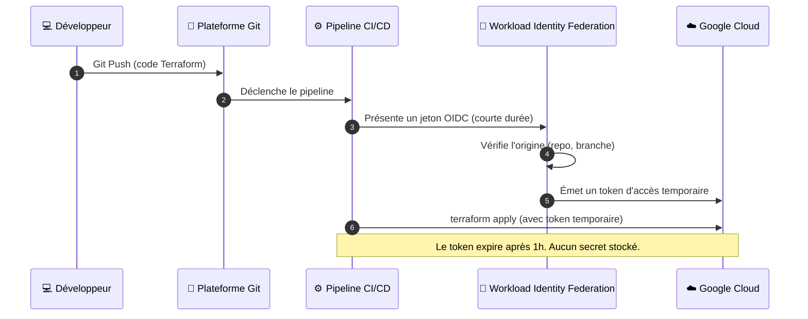

**Pourquoi c'est important** :
- Une clé JSON exportée = un secret statique qui peut fuiter (commit accidentel, poste compromis).
- Le WIF = un jeton dynamique, limité dans le temps, lié à un repo et une branche spécifiques.
- C'est la **recommandation officielle de Google** pour tous les pipelines CI/CD.

**Ce dont nous avons besoin côté client** :
1. Créer un **Workload Identity Pool** (ex: `github-pool` ou `gitlab-pool`).
2. Créer un **Provider** dans ce pool, lié à votre plateforme Git (OIDC).
3. Créer un **Service Account** `terraform-sa` avec les droits de déploiement.
4. Autoriser le Provider à impersonner le SA (binding IAM).

> Pyl.Tech vous accompagnera sur cette configuration.


---

## 4. L'Architecture Technique Proposée

### 4.1. Vue Globale de la Plateforme

L'architecture repose sur deux paradigmes complémentaires et totalement découplés :

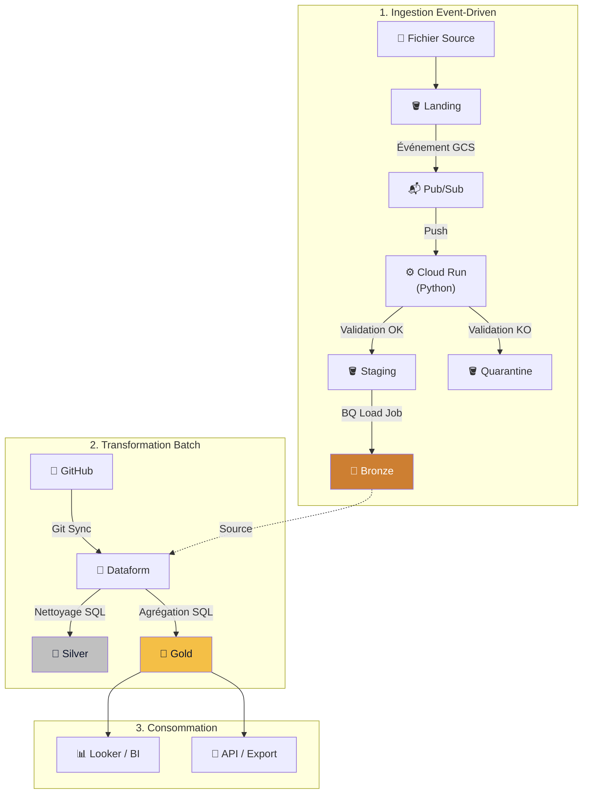

### 4.2. Flux d'Ingestion Détaillé (Event-Driven)

Voici le parcours complet d'un fichier, de son dépôt à son chargement dans l'entrepôt, avec tous les cas d'erreur :

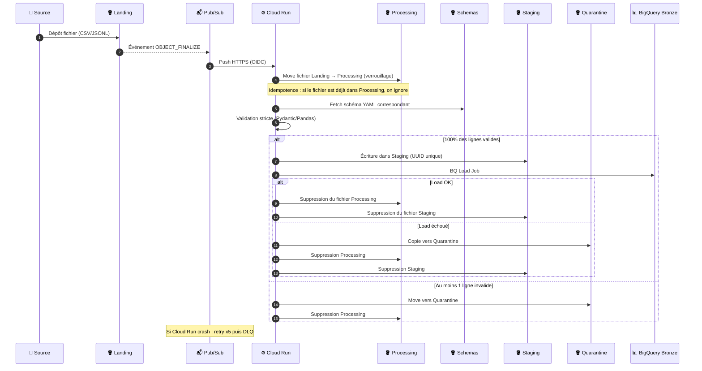

**Points clés de résilience** :
- **Idempotence** : Le move vers `Processing` agit comme un verrou atomique. Un même fichier ne peut pas être traité deux fois en parallèle.
- **All-or-Nothing** : Si une seule ligne est invalide, le fichier entier est rejeté en quarantaine. Aucune donnée partielle n'entre dans l'entrepôt.
- **Dead Letter Queue (DLQ)** : Après 5 échecs de livraison Pub/Sub, le message part dans un topic DLQ pour investigation manuelle.
- **Nettoyage automatique** : Des règles de lifecycle GCS suppriment automatiquement les fichiers orphelins (Processing: 1j, Staging: 1j, Quarantine: Nearline à 30j, suppression à 90j).

### 4.3. Flux de Transformation (Dataform / Batch)

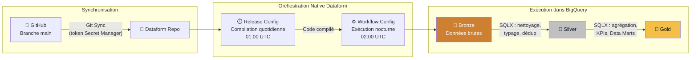

| Couche | Contenu | Exemple |
|:-------|:--------|:--------|
| **Bronze** | Données brutes, telles qu'ingérées. Aucune transformation. | `bronze.example_raw_data` |
| **Silver** | Données nettoyées, typées, dédupliquées, historisées. | `silver.clean_example_data` |
| **Gold** | Agrégations métier, KPIs, Data Marts prêts pour la BI. | `gold.kpi_monthly_summary` |

### 4.4. Schémas de Validation (Contrats de Données)

Chaque type de fichier ingéré est décrit par un contrat YAML versionné, stocké dans le bucket `Schemas`. Exemple concret :

```yaml
# schemas/bronze/example_raw_data.yaml
version: 1
description: "Example raw data schema for ingestion validation"

fields:
  - name: id
    type: int
    nullable: false
    description: "Unique identifier for the record"
  - name: name
    type: str
    nullable: false
    description: "Name of the entity"
  - name: value
    type: float
    nullable: true
    description: "Numeric value associated with the record"
```

**Pour chaque nouveau Use Case**, il suffira de créer un fichier YAML décrivant les colonnes attendues, leurs types et les règles de nullabilité. Le service d'ingestion s'adapte automatiquement.

---

## 5. Les Services GCP Utilisés (Catalogue POC)

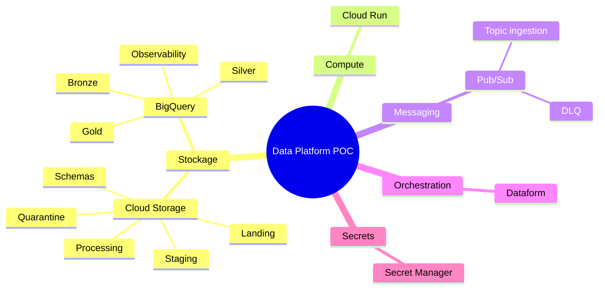

| Service | Rôle dans le POC | Modèle de facturation |
|:--------|:-----------------|:----------------------|
| **Cloud Storage** | 6 buckets : Landing (réception), Processing (verrou), Staging (tampon), Quarantine (erreurs), Schemas (contrats YAML), Archive | Stockage au Go/mois + opérations |
| **Pub/Sub** | Bus événementiel : notification GCS → Cloud Run. Topic DLQ pour les messages en échec. | Par message (premiers 10 Go/mois gratuits) |
| **Cloud Run** | Service d'ingestion Python. S'allume à la demande, s'éteint à 0 instance au repos. | CPU/mémoire par seconde d'exécution |
| **BigQuery** | Entrepôt analytique : 4 datasets (Bronze, Silver, Gold, Observability Logs). Requêtes SQL à la demande. | Stockage + requêtes (premier To/mois gratuit) |
| **Dataform** | Orchestration des transformations SQL. Synchronisation Git native. Release + Workflow configs. | Gratuit (intégré à BigQuery) |
| **Secret Manager** | Stockage sécurisé du token GitHub pour la synchronisation Dataform. | Par version de secret + accès |

---

## 6. Pratiques d'Ingénierie (GitOps, Terraform, CI/CD)

### 6.1. Outil de Versioning (Question Ouverte)

Nous devons identifier votre plateforme Git existante. Le choix impacte la configuration du WIF et des pipelines CI/CD :

| Plateforme | CI/CD Intégré | Support WIF GCP | Notes |
|:-----------|:--------------|:----------------|:------|
| **GitHub** | GitHub Actions | Natif (OIDC) | Notre référence actuelle. WIF documenté par Google. |
| **GitLab** | GitLab CI | Natif (OIDC) | Excellent support. Self-hosted ou SaaS. |
| **Azure DevOps** | Azure Pipelines | Via Federated Credentials | Fonctionne mais config plus complexe. |
| **Bitbucket** | Bitbucket Pipelines | Via OIDC | Support OIDC depuis 2023. |

### 6.2. Infrastructure as Code (Terraform)

Toute l'infrastructure est définie en code, versionnée, et revue avant déploiement.

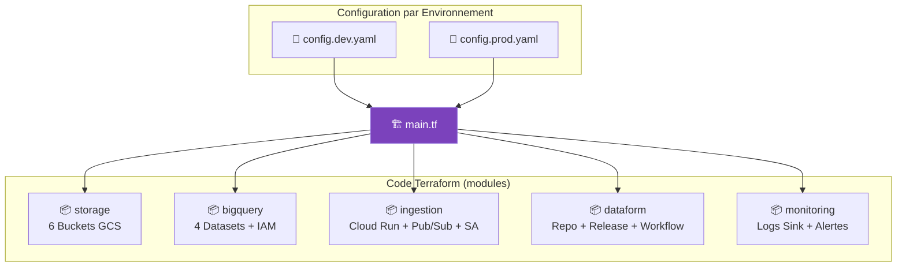

**Avantages concrets** :
- **Reproductibilité** : `terraform apply` recrée tout l'environnement en 5 minutes.
- **Auditabilité** : Chaque changement est dans l'historique Git (qui, quand, quoi).
- **Réversibilité** : `terraform destroy` supprime proprement toutes les ressources du POC.
- **Multi-environnement** : Un seul code, paramétré par fichier YAML (`config.dev.yaml`, `config.prod.yaml`).

### 6.3. Pipelines CI/CD

Trois pipelines automatisés assurent la qualité et le déploiement continu :

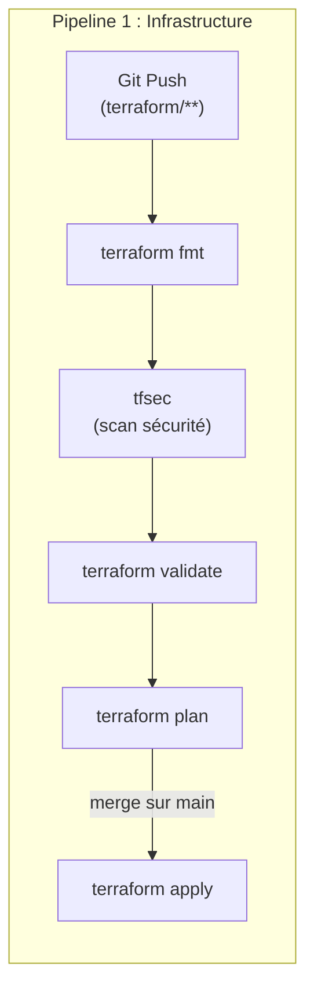

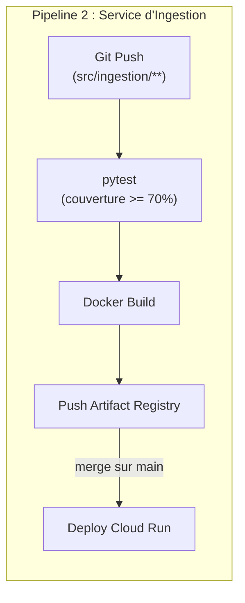

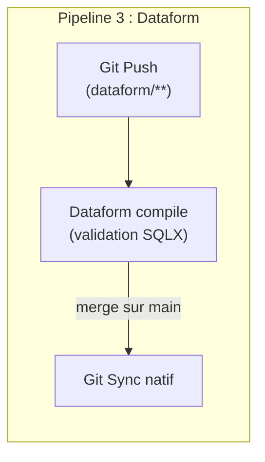

| Pipeline | Déclencheur | Gate de qualité | Déploiement |
|:---------|:------------|:----------------|:------------|
| Infrastructure | Modification dans `terraform/**` ou `schemas/**` | `tfsec` (scan sécu) + `terraform validate` | `terraform apply` sur merge `main` |
| Ingestion | Modification dans `src/ingestion/**` | `pytest` avec couverture ≥ 70% | Build Docker + Deploy Cloud Run |
| Dataform | Modification dans `dataform/**` | Compilation SQLX | Sync Git natif vers Dataform GCP |

---

## 7. Observabilité (Monitoring & Alerting)

Même en phase POC, nous mettons en place une observabilité complète pour diagnostiquer rapidement tout problème.

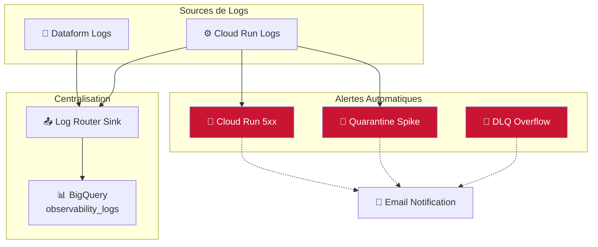

| Alerte | Condition | Action |
|:-------|:----------|:-------|
| **Quarantine Spike** | Un fichier est mis en quarantaine | Email immédiat → vérifier le fichier source |
| **DLQ Overflow** | Messages non livrés dans la Dead Letter Queue | Email → investiguer les erreurs Cloud Run |
| **Cloud Run 5xx** | Erreurs serveur sur le service d'ingestion | Email → consulter les logs Cloud Run |

---

## 8. Synthèse & Discussion d'Atelier

### Actions Immédiates (à valider en atelier)

| Priorité | Action | Responsable | Deadline suggérée |
|:--------:|:-------|:------------|:------------------|
| 🔴 | Créer le projet GCP POC | Admin GCP Client | S+1 |
| 🔴 | Créer les 3 groupes IAM | Admin Workspace/AD | S+1 |
| 🔴 | Identifier l'outil de versioning | Chef de Projet Client | Immédiat |
| 🟡 | Créer le dépôt Git et donner accès à Pyl.Tech | Admin Git | S+1 |
| 🟡 | Configurer le WIF (accompagné par Pyl.Tech) | Admin GCP + Pyl.Tech | S+2 |
| 🟢 | Identifier le premier Use Case métier | Métier + Data Engineers | S+2 |
| 🟢 | Fournir un échantillon de données pour le POC | Métier | S+3 |

### Questions Ouvertes pour Discussion

**Outillage & Organisation** :
- Quel outil de versioning utilisez-vous (GitHub, GitLab, Azure DevOps, Bitbucket) ?
- Avez-vous des runners CI/CD existants ou faut-il les provisionner ?
- Qui sera le point de contact technique côté client pour les accès GCP ?

**Données & Use Cases** :
- Quels sont les cas d'usage métiers prioritaires à démontrer dans le POC ?
- Quels sont les formats (CSV, JSONL, Excel ?), volumes et fréquences des fichiers sources ?
- Y a-t-il des contraintes réglementaires sur les données (RGPD, données sensibles) ?

**Sécurité & Réseau** :
- Le projet GCP POC aura-t-il des restrictions réseau (VPC Service Controls, pare-feu) ?
- Les fichiers sources seront-ils déposés manuellement ou via un système automatisé (SFTP, API) ?

### Roadmap : Du POC à l'Industrialisation

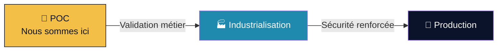

| Phase | Périmètre | Ce qui s'ajoute |
|:------|:----------|:----------------|
| **POC** (actuel) | Architecture event-driven, 1-2 use cases, CI/CD basique | Validation technique et métier |
| **Industrialisation** | Multi-environnement (dev/staging/prod), SLOs, runbooks | Landing Zone sécurisée, VPC, CMEK, Dataplex, tests E2E |
| **Production** | Plateforme complète, monitoring 24/7 | Alerting PagerDuty/Slack, DR, capacity planning |

---

*Ce document est un livrable Pyl.Tech. Il sera mis à jour au fil des ateliers.*

<div style="color: #208AAE; text-align: right; font-size: 0.9em; font-weight: bold;">
© Copyright 2026 Pyl.Tech
</div>
