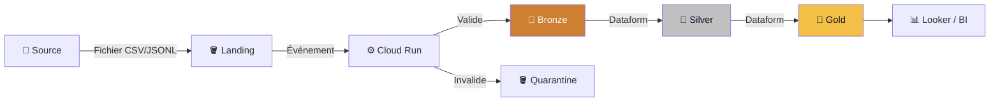
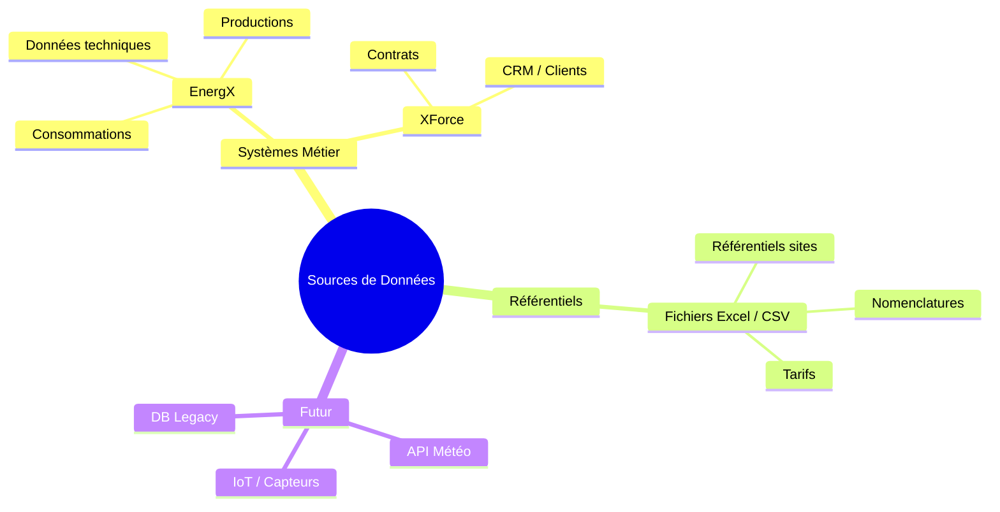
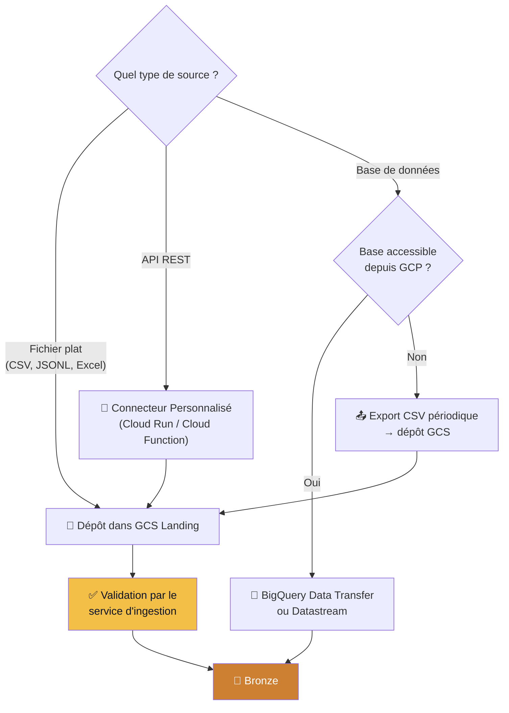
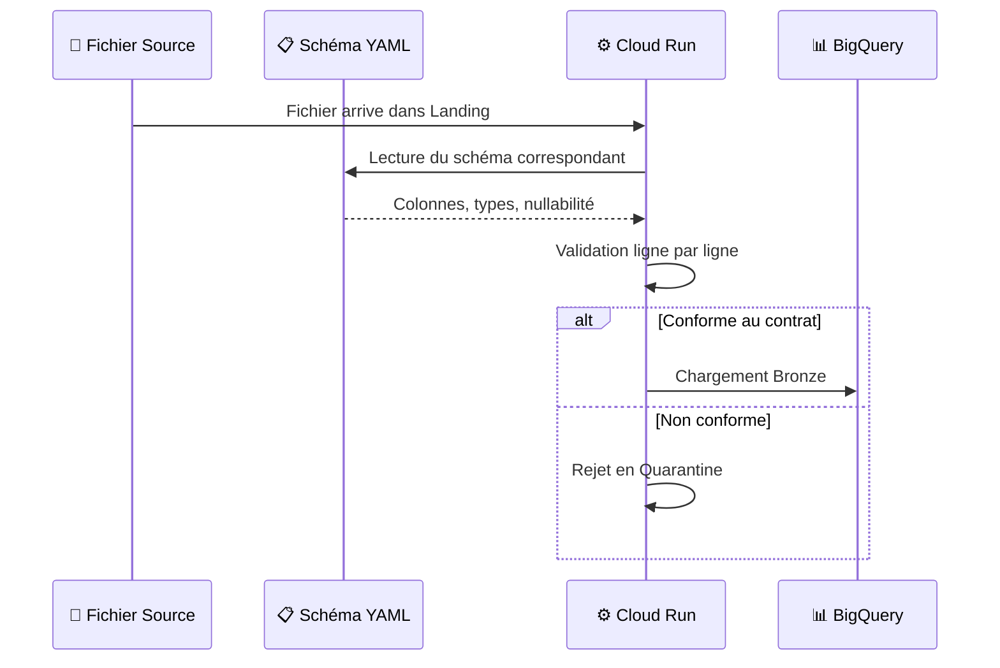
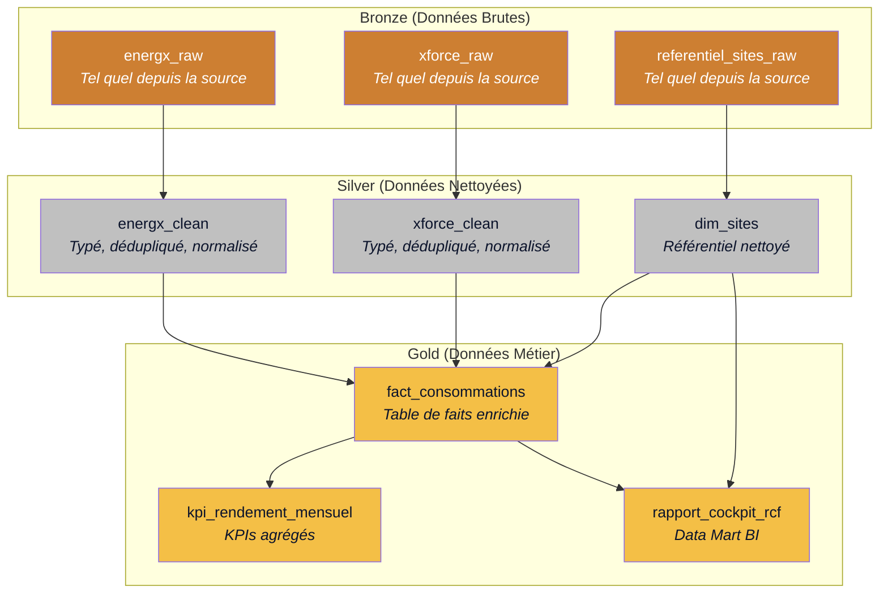
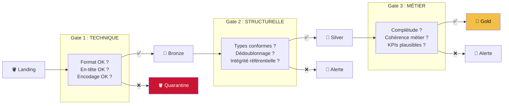
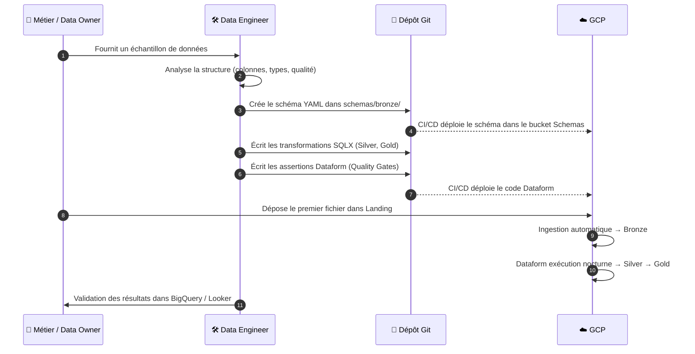
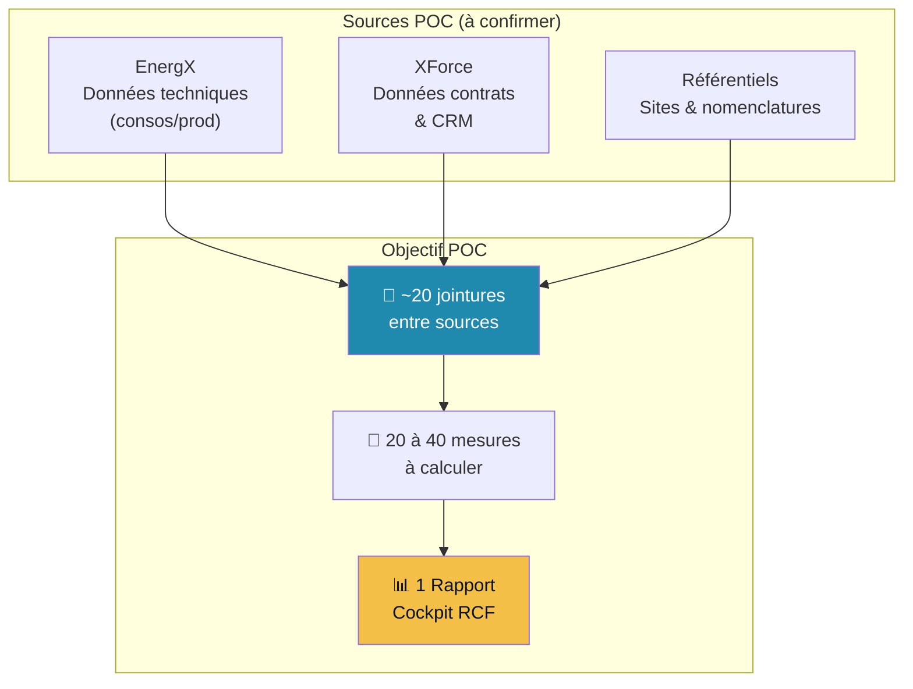

# Pyl.Tech : Atelier 2 - Sources de Données & Ingestion (Phase POC)

> **Date** : Mai 2026 | **Auteurs** : Équipe Pyl.Tech

*Ce document constitue le support du deuxième atelier technique. Il est centré sur l'identification des sources de données à intégrer dans le POC, leur structure, les transformations nécessaires et la méthode de chargement.*

*Objectif : à l'issue de cet atelier, nous devons avoir une vision claire des 1 à 2 sources de données prioritaires qui alimenteront le Data Hub pour le pilote.*

---

## 1. Rappel de l'Architecture d'Ingestion

Pour mémoire, voici le flux validé lors de l'atelier 1 :



**Rappel du principe All-or-Nothing** : Chaque fichier est validé intégralement. Si une seule ligne est invalide, le fichier complet est rejeté en quarantaine. Aucune donnée partielle n'entre dans l'entrepôt.

---

## 2. Panorama des Sources de Données

### 2.1. Cartographie des Sources Identifiées



### 2.2. Détail des Sources

| Source | Type | Contenu Métier | Format Attendu | Fréquence | Volume Estimé | Priorité POC |
|:-------|:-----|:---------------|:---------------|:----------|:--------------|:-------------|
| **EnergX** | Système technique | Consommations énergétiques, données de production, relevés | CSV / JSONL / API ? | Quotidien à horaire | À déterminer | 🔴 POC |
| **XForce** | CRM / Contrats | Données clients, contrats, sites, conditions commerciales | CSV / JSONL / API ? | Quotidien | À déterminer | 🔴 POC |
| **Fichiers référentiels** | Dépôt manuel | Référentiels de sites, nomenclatures, tables de correspondance | Excel / CSV | Ponctuel / Mensuel | Faible | 🟡 POC si pertinent |
| **IoT / Capteurs** | Flux temps réel | Données de capteurs terrain | API / MQTT | Continu | Élevé | 🟢 Post-POC |
| **API Météo** | API externe | Données météorologiques contextuelles | REST API JSON | Horaire | Faible | 🟢 Post-POC |
| **DB Legacy** | Base existante | Historiques, données patrimoniales | Export SQL / CSV | Migration unique | Variable | 🟢 Post-POC |

### 2.3. Arbre de Décision : Comment Charger une Source ?



**Pour le POC**, nous privilégions systématiquement la méthode la plus simple : **dépôt de fichiers plats (CSV/JSONL) dans le bucket Landing**. Même si une source dispose d'une API, un export fichier périodique est plus rapide à mettre en œuvre et suffisant pour valider l'architecture.

---

## 3. Structure des Données & Contrats de Schéma

### 3.1. Principe des Contrats de Données (Data Contracts)

Chaque source de données est décrite par un **contrat de schéma YAML** qui définit les colonnes attendues, leurs types et les règles de validation. Ce contrat est le "garde-fou" de l'ingestion.



### 3.2. Exemple de Contrat de Schéma

Voici un exemple de contrat YAML tel qu'il existe aujourd'hui dans le dépôt :

```yaml
# schemas/bronze/example_raw_data.yaml
version: 1
description: "Example raw data schema for ingestion validation"

fields:
  - name: id
    type: int
    nullable: false
    description: "Unique identifier for the record"
  - name: name
    type: str
    nullable: false
    description: "Name of the entity"
  - name: value
    type: float
    nullable: true
    description: "Numeric value associated with the record"
  - name: record_date
    type: date
    format: "%d/%m/%Y"
    nullable: false
    description: "Date of the record (e.g., 15/01/2026)"
```

### 3.3. Types Supportés

| Type YAML | Type Python (Pydantic) | Type BigQuery | Exemple |
|:----------|:----------------------|:-------------|:--------|
| `int` | `int` | `INTEGER` | `42` |
| `float` | `float` | `FLOAT` | `3.14` |
| `str` | `str` | `STRING` | `"Paris"` |
| `bool` | `bool` | `BOOLEAN` | `true` |
| `date` | `date` | `DATE` | `2026-01-15`<br/>*(L'attribut `format: "%d/%m/%Y"` est obligatoire si la date source n'est pas au format ISO `YYYY-MM-DD`)* |
| `datetime` | `datetime` | `TIMESTAMP` | `2026-01-15T08:30:00Z` |

### 3.4. Travail à Réaliser en Atelier (par Source)

Pour chaque source prioritaire du POC, nous devons remplir la fiche suivante :

> **Fiche Source : [NOM DE LA SOURCE]**
>
> | Critère | Réponse |
> |:--------|:--------|
> | Nom de la source | |
> | Système d'origine | |
> | Format du fichier | CSV / JSONL / Excel / Autre |
> | Encodage | UTF-8 / ISO-8859-1 / Autre |
> | Séparateur (si CSV) | `;` / `,` / `\t` |
> | Ligne d'en-tête | Oui / Non |
> | Nombre de colonnes | |
> | Volume moyen par fichier | |
> | Fréquence de dépôt | |
> | Qui dépose le fichier ? | Automatisé / Manuel |
> | Échantillon disponible ? | Oui / Non |

---

## 4. Les Transformations (Bronze → Silver → Gold)

### 4.1. Vue d'Ensemble du Pipeline de Transformation



### 4.2. Détail des Transformations par Couche

| Couche | Opérations | Outil | Exemples Concrets |
|:-------|:-----------|:------|:------------------|
| **Bronze → Silver** | Typage fort, dédoublonnage, normalisation des dates, gestion des valeurs nulles, renommage des colonnes | Dataform (SQLX) | Convertir les dates `"15/01/2026"` en `DATE`, supprimer les doublons par clé primaire, uniformiser les unités (kWh vs MWh) |
| **Silver → Gold** | Jointures inter-sources, calculs métier, agrégations, création de KPIs | Dataform (SQLX) | Joindre EnergX (consos) avec XForce (contrats) sur l'ID site, calculer le rendement énergétique, agréger par mois |

### 4.3. Quality Gates (Contrôle Qualité à Chaque Couche)



| Gate | Couche | Implémenté par | Exemples de Tests |
|:-----|:-------|:---------------|:------------------|
| **Gate 1 (Technique)** | Landing → Bronze | Service d'ingestion (Python) | Format CSV valide, colonnes conformes au schéma YAML, types corrects |
| **Gate 2 (Structurelle)** | Bronze → Silver | Dataform Assertions (SQLX) | Pas de doublons sur la clé primaire, intégrité référentielle (site_id existe dans dim_sites), complétude des champs obligatoires |
| **Gate 3 (Métier)** | Silver → Gold | Dataform Assertions (SQLX) | Rendement entre 0% et 150%, pas de consommation négative, dates dans une plage cohérente |

### 4.4. Exemple d'Assertion Dataform (SQLX)

```sql
-- definitions/assertions/assert_no_duplicate_sites.sqlx
config {
  type: "assertion",
  database: "mon-projet",
  schema: "silver"
}

-- Vérifie qu'il n'y a aucun doublon dans la dimension sites
SELECT site_id, COUNT(*) as cnt
FROM ${ref("dim_sites")}
GROUP BY site_id
HAVING cnt > 1
-- Si cette requête retourne des lignes → l'assertion échoue
```

---

## 5. Méthode de Chargement : Étapes Pratiques

### 5.1. Processus de Bout en Bout pour une Nouvelle Source



### 5.2. Conventions de Nommage des Fichiers

Pour que le service d'ingestion identifie automatiquement le schéma à appliquer, les fichiers doivent respecter une convention :

```
landing/<nom_schema>/<nom_fichier>.<extension>
```

| Exemple de Chemin | Schéma Détecté | Fichier de Contrat |
|:------------------|:---------------|:-------------------|
| `landing/energx_consos/export_2026-05-19.csv` | `energx_consos` | `schemas/bronze/energx_consos.yaml` |
| `landing/xforce_contrats/contrats_q1.jsonl` | `xforce_contrats` | `schemas/bronze/xforce_contrats.yaml` |
| `landing/referentiel_sites/sites_v3.csv` | `referentiel_sites` | `schemas/bronze/referentiel_sites.yaml` |

### 5.3. Stratégies de Chargement (Ingestion vs Transformation)

Il est crucial de distinguer comment la donnée brute entre dans le système (Ingestion), et comment elle est gérée dans le temps (Transformation).

**1. À l'Ingestion (Landing → Bronze via Cloud Run) :**
Le service d'ingestion ne fait aucune logique métier. Il se contente d'insérer les fichiers valides.
| Mode Cloud Run | Comportement | Quand l'utiliser |
|:---------------|:-------------|:-----------------|
| **Append** | Ajoute les nouvelles lignes à la table brute existante | Données incrémentales (consos quotidiennes, relevés horaires) |
| **Replace** | Écrase et remplace intégralement la table brute | Fichiers référentiels déposés manuellement (liste des sites, tarifs) |

**2. À la Transformation (Bronze → Silver via Dataform) :**
C'est ici que l'historisation complexe est gérée.
| Stratégie Dataform | Comportement | Quand l'utiliser |
|:-------------------|:-------------|:-----------------|
| **Incremental (SCD / Delta)** | Gère l'historisation (Slowly Changing Dimensions) via un `MERGE` SQL | Contrats, données CRM qui évoluent dans le temps |
| **Table (Full Refresh)** | Recalcule toute la table métier à chaque exécution | KPIs quotidiens simples, référentiels |

---

## 6. Focus POC : Sources Prioritaires

### 6.1. Périmètre Proposé pour le Pilote

D'après le cadrage initial, le POC se concentre sur **1 dataset** permettant de produire le **rapport cockpit RCF** :



### 6.2. Questions Clés pour Chaque Source

**EnergX (Données Techniques)** :
- Quel format d'export est disponible (CSV, API, base directe) ?
- Quelles sont les colonnes principales (site_id, timestamp, valeur, unité) ?
- Quelle granularité temporelle (horaire, journalière, mensuelle) ?
- Un échantillon anonymisé est-il disponible ?

**XForce (Contrats & CRM)** :
- Comment extraire les données (export CSV depuis l'UI, API, extraction SQL) ?
- Quelles entités sont nécessaires pour le cockpit RCF (contrats, clients, sites) ?
- Y a-t-il des données sensibles (noms, adresses) nécessitant une pseudonymisation ?

**Référentiels (Sites, Nomenclatures)** :
- Existe-t-il un fichier Excel de référence des sites ?
- Quel est l'identifiant unique d'un site (code interne, adresse, coordonnées GPS) ?
- Qui est le propriétaire / mainteneur de ce référentiel ?

---

## 7. Synthèse & Actions de Sortie d'Atelier

### Livrables Attendus

| # | Livrable | Responsable | Deadline |
|:-:|:---------|:------------|:---------|
| 1 | Échantillon de données EnergX (anonymisé) | Métier / IT Client | S+1 |
| 2 | Échantillon de données XForce (anonymisé) | Métier / IT Client | S+1 |
| 3 | Fichier référentiel des sites | Métier Client | S+1 |
| 4 | Schémas YAML pour chaque source | Pyl.Tech | S+2 (après réception des échantillons) |
| 5 | Transformations SQLX (Silver + Gold) | Pyl.Tech | S+3 |
| 6 | Assertions Dataform (Quality Gates) | Pyl.Tech | S+3 |

### Questions Ouvertes

- **Accès aux données** : Qui peut fournir un export des systèmes EnergX et XForce ? Faut-il une demande formelle ?
- **Sensibilité des données** : Les échantillons contiennent-ils des données personnelles (RGPD) ? Si oui, prévoir une pseudonymisation avant l'export.
- **Clé de jointure** : Quel identifiant commun relie EnergX, XForce et les référentiels de sites ? (code site, numéro de contrat, etc.)
- **Définition des KPIs** : Quels sont les 5 premiers KPIs du cockpit RCF que nous devons calculer dans la couche Gold ?

---

*Ce document est un livrable Pyl.Tech. Il sera mis à jour au fil des ateliers.*

<div style="color: #208AAE; text-align: right; font-size: 0.9em; font-weight: bold;">
© Copyright 2026 Pyl.Tech
</div>
